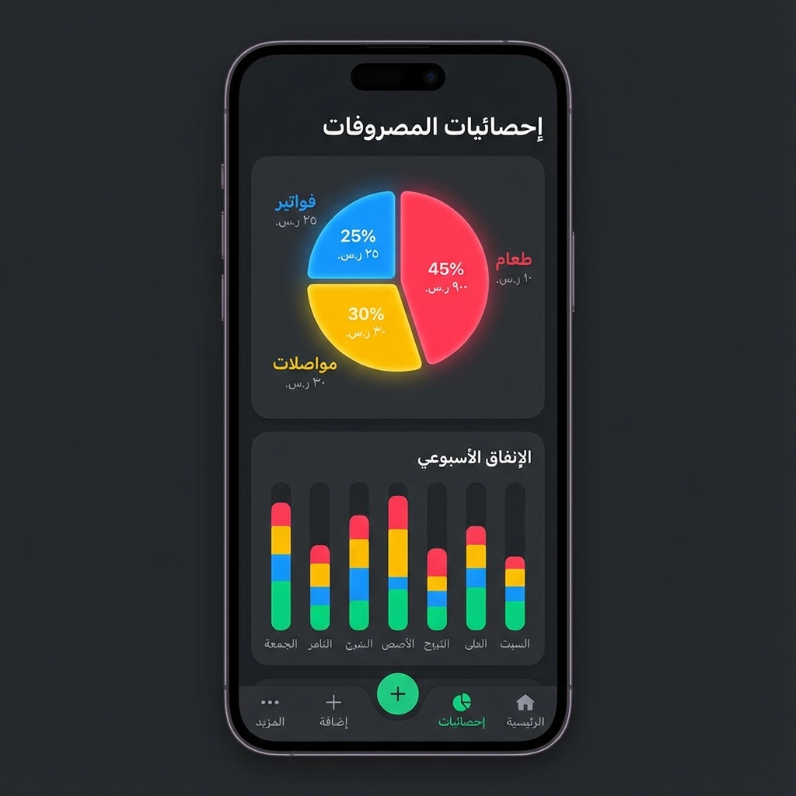
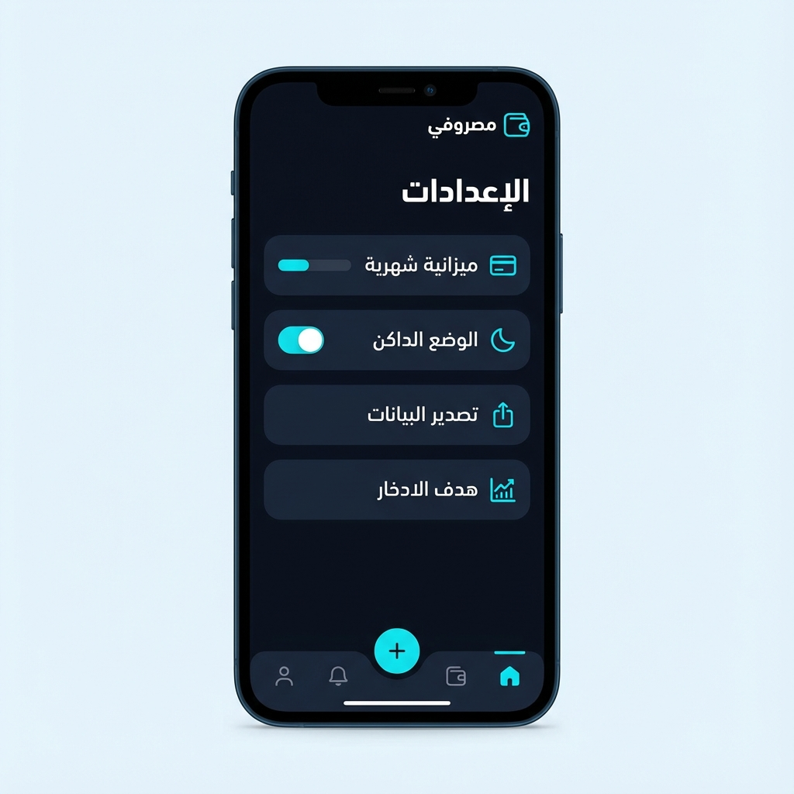

# 💰 مصروفي (Masrofy)

تطبيق **مصروفي** هو تطبيق متكامل وسهل الاستخدام لتتبع المصروفات وإدارة الميزانية الشخصية، تم تطويره باستخدام Flutter. يهدف التطبيق إلى مساعدتك في التحكم في نفقاتك وتحقيق أهدافك المالية بواجهة عصرية ودعم كامل للغة العربية.

## ✨ المميزات الرئيسية

*   **📊 تتبع المصروفات:** تسجيل المصروفات اليومية بسهولة مع تحديد التصنيف، المبلغ، التاريخ، وملاحظات إضافية.
*   **📅 إدارة الميزانية الشهرية:** تحديد ميزانية شهرية ومتابعة المتبقي منها لحظة بلحظة.
*   **🎯 أهداف التوفير:** حدد هدفاً مالياً (مثل شراء هاتف جديد) وتابع تقدمك نحو تحقيقه من خلال شريط تقدم تفاعلي ورسائل تشجيعية.
*   **⏱️ خطة مخصصة:** إمكانية تحديد مدة زمنية مخصصة للميزانية (مثلاً 30 يوم تبدأ من يوم 25 في الشهر) مع عداد تنازلي للأيام المتبقية.
*   **🔔 إشعارات يومية:** تذكير يومي في الساعة 9 مساءً لتسجيل مصروفاتك حتى لا تنسى.
*   **📈 إحصائيات وتقارير:** رسوم بيانية توضح توزيع مصروفاتك حسب التصنيفات، وتنبيهات عند الاقتراب من تجاوز ميزانية تصنيف معين.
*   **🔄 مصاريف ثابتة وتكرارية:** إضافة المصاريف الثابتة (مثل الإيجار، الفواتير) تلقائياً في بداية كل شهر.
*   **🔍 بحث وفلترة:** إمكانية البحث في المصروفات السابقة وفلترتها حسب الشهر.
*   **💾 نسخ احتياطي واستعادة:** تصدير بياناتك كملف نصي (JSON) وحفظه، واستعادته في أي وقت لضمان عدم ضياع بياناتك.
*   **🌙 الوضع الليلي (Dark Mode):** دعم كامل للمظهر الداكن لراحة العين وتوفير البطارية.
*   **🚀 واجهة عربية بالكامل:** تصميم يدعم الاتجاه من اليمين لليسار (RTL) مع خطوط عربية مريحة (Cairo Font).

## 📱 لقطات الشاشة

<table align="center">
  <tr>
    <td align="center">
      
      <br />
      <b>الشاشة الرئيسية</b>
    </td>
    <td align="center">
      
      <br />
      <b>الإحصائيات</b>
    </td>
    <td align="center">
      
      <br />
      <b>الإعدادات</b>
    </td>
  </tr>
</table> 

## 🛠️ التقنيات المستخدمة

*   **Flutter & Dart:** لبناء التطبيق ليعمل على Android (و iOS مستقبلاً).
*   **Shared Preferences:** لحفظ البيانات محلياً على الجهاز.
*   **Flutter Local Notifications:** لإدارة الإشعارات والتذكيرات.
*   **FL Chart:** لعرض الرسوم البيانية والإحصائيات.
*   **Google Fonts:** لاستخدام خط "Cairo" العربي.
*   **Intl:** لتنسيق التواريخ والأرقام.

## 📥 التحميل والتثبيت

يمكنك تحميل النسخة الأخيرة من التطبيق بصيغة APK من مجلد `releases` (إذا قمت برفعه) أو بناء التطبيق بنفسك.

## 💻 للمطورين (تشغيل المشروع)

1.  تأكد من تثبيت [Flutter SDK](https://flutter.dev/docs/get-started/install).
2.  انسخ المستودع:
    ```bash
    git clone https://github.com/YOUR_USERNAME/masrofy.git
    ```
3.  اذهب لمجلد المشروع:
    ```bash
    cd masrofy
    ```
4.  ثبت المكتبات:
    ```bash
    flutter pub get
    ```
5.  شغل التطبيق:
    ```bash
    flutter run
    ```

## 🤝 المساهمة

نرحب بمساهماتكم! إذا وجدت خطأ أو لديك اقتراح لميزة جديدة، لا تتردد في فتح Issue أو إرسال Pull Request.

---
تم التطوير بحب ❤️ لمساعدتك على إدارة أموالك بذكاء.
